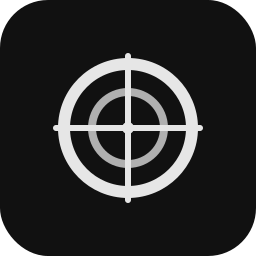

  

<h1 align="center">ColMate</h1>

  Collimation helper for telescopes – live camera overlay tool

---

## What is this?

ColMate is a simple Windows app that helps you collimate your telescope. It shows a live camera feed with adjustable overlay circles and a crosshair, so you can align your optics precisely.

Built for astrophotographers and telescope enthusiasts who want a no-nonsense tool that just works.

## Features

- **Live camera preview** – Works with USB cameras, webcams, astro cameras
- **Adjustable overlay circles** – Add as many as you need, customize radius, thickness, color
- **Show/hide circles** – Toggle visibility for each circle individually
- **Crosshair overlay** – Adjustable length, thickness, and color
- **Calibration center** – Set your exact optical center point
- **Manual offset adjustment** – Fine-tune the overlay position
- **Zoom & pan** – Get a closer look at your collimation
- **Focus & exposure control** – Adjust camera settings directly
- **Dark UI** – Easy on the eyes during night sessions

## Screenshot

_Coming soon_

## Requirements

- Windows 10/11
- .NET 8.0 Runtime
- USB camera or webcam

## Getting Started

1. Clone or download the repo
2. Open in Visual Studio or run `dotnet build`
3. Run `dotnet run` or start the compiled exe
4. Select your camera and hit Start
5. Add circles, adjust settings, collimate!

## Tech Stack

- WPF (.NET 8)
- OpenCvSharp4 for camera handling
- DirectShowLib for device enumeration

## License

MIT – see [LICENSE.txt](LICENSE.txt)
